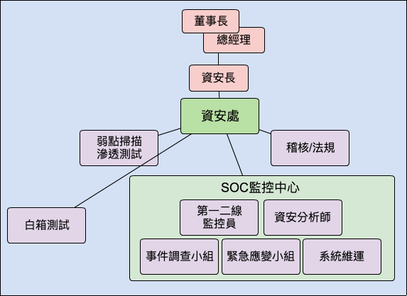
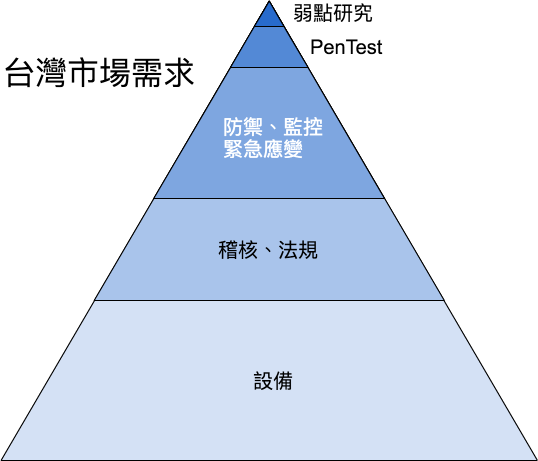

# TDOH技能樹 - 職業版

我是TDOH的Ethen

聽到不少「學了資安，以後該怎麼以此活下去」的疑問，所以想就著目前台灣/世界上的資安相關職業做一個介紹，希望能讓大家對自己所學更加安心，也可以選擇一些目標去嘗試

「除了黑產之外，你還有更好的路可以選擇」

*   也恭請各位前輩的補充 m(_ _)m

授權方式 [CC: BY-SA](https://creativecommons.org/licenses/by-sa/3.0/tw/legalcode) 

**HITCON 2016 演講投影片**

[https://slides.com/sakura26/securityjobintaiwan](https://slides.com/sakura26/securityjobintaiwan)

推一下資安防禦系列課程「黑魔法防禦術」

[agenda](README.md)

## 目標對象

學生，或是有意跨入資安產業的新人

## 四大重點

*   了解自己
*   了解職業
*   了解雇主（企業）
*   瞭解環境

不管市面上有什麼職業可選，最重要的是先了解自己：

## 類別

如果你還沒有把自己定位好，也無妨

想要選擇多個角色，也很好

發現自己的定位不再這邊所述，更好，歡迎你寫下來，讓更多人知道，還有這條路可以走

### 攻擊者

*   可能是“想要看到不給看的東西”
*   想做出很酷的事情
*   想被眾人知道
*   想成為巫師，資訊萬物為我所用 

>   參照遊戲WatchDog, 或是動畫Ghost in the shell 
>   這不是做不到的，即便可能需要國家級的資源。美國NSA就擁有這種本事
>   NSA 有這個本事，但也是暗著來啊～～XD

*   純粹就是想要以破壞為目的

*   我倒是不這麼看耶，大多是情況下破壞行為也是基於一些個人目標而出現的，例如實力證明，或是想紅。至於私怨就另當別論了

### 防禦者

*   自己的領土不容外人侵犯
*   解決問題的自豪
*   單純的想把事情做好
*   莫名其妙的正義感想把壞人抓到

### 創造者

*   想創造些新的東西
*   想改變環境

>   這更像是一個特質，我想Birdman是一個很好的例子：除了鑑識與系統的實力外，也具有創造的特質，把知識化為產品與企業，讓更多的人/企業受惠

## 市場定位

攻擊者：先行者、菁英、打手、教頭

防禦者：各領地的保鑣

網軍：拿公發武器作戰的海量部隊

>   別小看網軍，雖然他們個人的技術往往不怎麼樣，但是當他們一票人在對你車輪戰的時候，也是很難抵擋的。況且台灣多數政府企業都不需要很強的技術才打得下....(遠目 
>   遠目 * N^n

## 企業類型

*   甲方：合約上的委託者，一般來說是有資安需求的企業或政府單位  

    *   會痛的：資安事件會直接導致資產或品牌損失，有危及生存可能的單位

        *   金融單位、有高機敏度需求如台積電等企業組織

    *   不會痛的：資安事件造成損失危害較小，或是僵化不願面對現實的老人過多的單位

        *   傳統產業、政府單位、國軍

## 常見甲方資安組織結構

＊大多數企業沒有這麼完整的結構

### 常見職位
#### 攻擊面

### PT滲透測試（黑箱）

[https://en.wikipedia.org/wiki/Penetration_test](https://en.wikipedia.org/wiki/Penetration_test)

[http://baike.baidu.com/view/1139765.htm](http://baike.baidu.com/view/1139765.htm)

以白帽駭客的身份，接受客戶委託，在客戶授權的範圍尋找弱點，最終提供報告，讓客戶知道如何強化自身的安全。

一般來說，會在有限的資訊的情況下進行測試，例如針對某個網站，或是企業網路為標的，在不影響客戶營運為前提做測試。而攻擊者往往是用手動方式進行攻擊探測，實現深度的檢測，與避免誤傷。

主要收益來自企業委託

### 原始碼檢測（白箱）

[https://www.openfoundry.org/tw/resourcecatalog/Security/Source-Code-Audit](https://www.openfoundry.org/tw/resourcecatalog/Security/Source-Code-Audit)

黑箱測試往往提供的資訊/資源有限，在一次測試期間中是不會找出所有弱點的。

白箱測試一般則是提供相當深入的資訊（包含系統原始碼），藉由逐行審核，來盡量找出最多的弱點。最終提供報告，讓客戶知道如何強化自身的安全。

現在已經有許多自動化工具可以協助檢測原始碼中的弱點，但是依然需要老經驗的駭客/開發者才有辦法解釋其意義。

主要收益來自企業委託

### 弱點研究

在攻擊中，往往會需要各種CVE或是0-day來作為突破點，而尋找這類弱點，進而發展出可以實用化的武器，就是弱點研究者的目標。這往往需要深入研究為基礎。

主要收益來自回報新弱點的獎金，或是銷售0-day給國安單位或是其他駭客

### 弱點掃描

沒有PT那麼帥，也常被惡質業務拿來魚目混珠，但是實際上是防禦上重要的基礎。

使用現成的弱點掃描工具對主機/網段進行掃描，並產生出弱點報告。這份報告中都是已知的弱點，企業應對這些現成弱點進行修復，或是藉由架構強化來避免遭受駭客利用。

一般來說。弱點報告對於客戶來說依然不好閱讀，會需要有經驗的人協助提供解釋或強化建議。

主要收益來自企業委託
#### 防禦面

>   ##### 網管
>   一般來說這不會被列在資安人員的行列，但是實際上他們站在很重要的角色，如果第一線的主機配置、管理人員沒有資安Sense，整個企業網路就會到處都是洞，補也補不完，還會跟資安人員唱反調...

>   ##### 開發者
>   開發者也需要安全，由於多數開發者只求程式會動，不求甚解與品質，有漏洞的程式時有所聞，所以才需要各種黑箱與白箱測試來補救。找到有資安常識的開發者可以大幅的降低事後處理的成本，但是一般來說他們不會被歸類於資安人員。

### SOC監控員

企業的運作是24HR的，駭客往往會在最少人注意的時段（ie.凌晨），從最不起眼的地方進行攻擊。如果沒有人隨時監視網路內的蛛絲馬跡，往往被攻下了都還沒有人發覺。

一般來說只有中大型企業有資源建立資安防禦中心，而監控員會24小時排班來確保沒有空窗期。倘若發現攻擊的跡象，會按照一系列SOP進行緊急應變，並視情況呼叫 緊急應變小組、事件調查小組 介入處理，在火燒大之前滅掉。

>   但是一般的大型企業24小時的SOC監控通常都是在睡覺，除非你的SIEM裡面安插了超大聲的警報搭配滿天閃的紅燈，可能才會稍微被注意到 
>   不過回歸正題，這裡面也需要去提到，到底什麼樣的反應時間才屬正常。 
>   一般國外大型金融行業從發現問題到二線甚至三線的動作是30分鐘內要完成阻擋，反觀國內的...30天就要偷偷笑了 
>   嗯...因為我曾經有幸在一個相當精實的SOC待過，台灣還是有認真的單位的（雖然很難存活....）

SOC監控又分為一線跟二線，一線的任務是檢視各種流量與Log判斷發生什麼事，注意警報，並按照SOP進行行動; 二線則是有經驗的駭客/工程師，瞭解網路與攻擊行為，負責撰寫規則來偵測攻擊，並寫下應變使用的SOP讓一線執行。

但不管是一線二線，只有時常接觸各種攻擊手法的駭客，才看得到攻擊的發生。

反過來看，這亦是一個絕佳的練功場，讓你有機會看到各種攻擊的手法，甚至與入侵者短兵相接。

>   AGAIN, reaction time....

### SOC系統維運

資安防禦中心是一個神經系統，藉由分析大量的流量與Log來了解企業內部網路的安全狀態。為了維持這個巨大的神經系統的正常運作（系統維運、斷線什麼的），也需要相當程度的人力與技術力的支援。

這比較像是系統工程師，不太駭客，所以喜歡幹這個的人比較少 :p

### 緊急應變小組

當駭客已經埋了後門，偷了資料，換了網頁，客戶哭天搶地的時候，就是緊急應變小組要出手的時候了。如何在保存證據的前提下，儘速讓受損的系統恢復運作，並且阻止駭客的進一步行動，不是一個簡單的任務，更不用說，你可能還跟駭客正在同一台主機上，你在認真恢復的時候，他可能已經從你不知道的後門回來，正在Drop DB!

一般來說，應變往往會需要瞭解現況，所以緊急應變小組往往會跟 事件調查 與 鑑識小組一起合作行動

緊急應變小組一般來說的必備成員有：權力夠高的管理階層、權限夠大的系統管理者、與經驗夠豐富的團員。緊急應變小組只在緊急狀況時集合，平常時則各自有各自的任務。

合理來說，這個組織應該由客戶企業內部於風險規劃階段建立，但實務上台灣大多數企業沒有這樣的配置，所以大多數由事件調查小組搭配客戶人員兼任。

### 稽核、法規導入

ISMS、ISO27001等法規，是協助企業從管理面降低風險，避免因為意外或是惡意攻擊時受到致命性打擊。良好的管理是一個大型企業的基礎，但是這畢竟比較偏向管理面，我就不多加著墨了。

在台灣，這是一個需求量滿大的生意，因為許多標案都有認證與稽核的要求，沒過就拿不到案子，所以常常會出現打假球的狀況.... 

但，這事實上是一個很重要的位置。資安的核心，要與企業價值彼此連接，最重要的就是風險管理的概念。風險控管將風險轉換為企業主管可以理解的損失與利潤，進而協助管理層做出決策，引入合理的資安計畫。缺乏風險管理的資安業務，往往會因為“無法評估投入成本是否有發揮效益”，導致案子無疾而終，或是客戶不願導入，這是當前資安界很大的問題。

台灣主要是四大會計師事務所在處理這類的案子，宏碁也有此類業務
#### 調查面

### 事件調查

當入侵事件發生，迫切需要回答以下幾個問題

*   發生了什麼異常
*   駭客做了什麼
*   怎麼進來的
*   怎麼阻止破壞擴散
*   弱點修補

找出答案，是事件調查小組的任務。事件調查者要極度熟悉作業系統、網路架構、Log分析等任務，從各系統中收集蛛絲馬跡，拼湊出事故的原貌，進而協助緊急應變小組阻止災害的擴大，把駭客擋在門外。

在事件調查中，有時會發現需要進行法律上的行動（諸如發現是競爭對手發起攻擊），此時證物的操作就需要專業的處理，確保可以作為法院上的有效證據，所以事件調查小組往往也會發展成鑑識小組。

基本上，把他們當成資安版的CSI就對了

由於本身算是救火隊般的存在，多數SOC會附屬建立這類事件調查小組，但還沒有看到有專門提供業務的公司在

### 鑑識

基本上與事件調查相同，唯一的差別是鑑識的目的是為了取得足以在法庭上獲勝的有效證據。為了確保證物的有效性，需要遵照特定的流程與限制，所以分析上的難度會比起事件調查來得高，也會需要使用受法院認可的分析、採樣工具來處理證物。而最終，分析師會以專家證人的身份上法庭，協助律師進行法律上的行動，因此對於法律的了解也是必要的。

目前由於台灣的法院與相關法規還不成熟，所以真正的鑑識還沒有被落實，但我們可以期待改變的發生。

>   台灣目前已經有數位鑑識協會的組織，不過關於法律面的推動，應該還有很長的路要走

### 惡意程式分析

駭客攻擊中，往往會使用多種惡意程式，諸如最近當紅的勒索病毒、駭客用來確保操控的後門、攻擊用的提權工具與exploit，或是感染內部網路的蠕蟲，各有各的活動特性。透過動靜態分析，除了可以了解該惡意程式的行為，也可以進一步分析出開發的國家、組織、意圖等，對於駭客研究來說是重要的資產。

>   著名的如birdman的xecure lab，收集大量惡意程式樣本，並在HITCON發表過駭客動向分析 
>   防毒廠商可能是這類職缺缺最大的

#### 其他

### 資安顧問

由於資安本身相當廣泛，大多數客戶都難以釐清自己的需求，也不知道該怎麼實行，此時顧問的角色就是非常重要的。透過**廣泛的經驗與視野**，深入尋找真正的需求，給出可行的建議，是一門要兼顧專業、溝通的特殊職位。

但也很可惜的是，台灣的業務生態系，很多掛著資安顧問的人並不是真正的資安專家。這些掛羊頭賣狗肉的業務只為了銷售產品攫取利益唬弄客戶，導致了客戶對資安的不信任。如何與假顧問做出區隔，我想是這個行業當前的一大挑戰

不過換個角度來說，真正的安全本來就不是仰賴“跟外界購買”就可以獲得的，而是客戶對自己品質的要求，以及風險管理的認知。台灣這邊還有很長的一段路要走。

### 資安設備廠商

嗯...說真的我不大喜歡把這個部分歸類到資安領域，原因是台灣的設備廠商大多數都是以銷售為主，目前我還沒有看到真正了解產品本身，並且能夠發揮價值的廠商。

但是，這些設備事實上也是很重要的一環。一個企業網路，本身需要各種防火牆、IDS、WAF等設備輔助來監控、規範、限制各種流量與行為，而廠商的角色，除了銷售外，深入了解自己的設備，知道自己的設備在整個安全中的定位，隨時間與環境成長，才是專業的廠商應有的作為。

不過，以我目前所見，大多數設備廠商並未給予自己的工程師足夠的時間與空間去成長。這是為什麼**我並不推薦這一條路**。

## 台灣的資安生態現況

台灣以中小企業為主，大多都還在“求生存”、“求賺錢”的階段徘徊，因此有大量的“設備”需求（缺乏基礎建設，或是萬靈丹症候群），以及“法規”需求（接標案所需）。

下一階段，企業會開始追求“安全”，希望避免現有的資產損失。此時基礎的防禦規劃、資安監控、緊急應變程序等的需求量就會開始提高，此時防禦面的需求會開始浮現

而進入到成熟的企業時，開始對安全的質量有所要求，也開始有了“與高手聯合防禦”的想法，開始願意接受PT、白箱測試等高單價服務，來提升產品/系統的品質，此時對攻擊面的需求開始增加

可以看到，就現階段來說，台灣的市場環境的需求，攻擊面是小的，還需要等待市場的成熟。如果你對於攻擊面有執著，我會建議試著擴展自己往海外發展，嘗試世界各大企業的漏洞獎金獵人（[Bug Bounty](https://en.wikipedia.org/wiki/Bug_bounty_program)）專案，回報弱點到[vulreport](https://vulreport.net/)或是[HITCON Zeroday](https://zeroday.hitcon.org/)平台建立自己的名聲，或是向DevCore的Allen大師尋求建議。

相對來說，防禦面則擁有相當程度的市場與成長性

加上台灣的金融單位數量很多，而中國的攻擊持續的成長，這些高機敏性的單位更加願意投入資源請有經驗有技術的防禦者進入企業內部建立防禦組織，這邊始終是缺人的，薪資也相對來得好。我很推薦有機會到客戶端，以“守衛者”的身份實際做過一輪的防禦，會是相當好的經驗。

當然，擁有足夠的實力，也不要忘記海外的機會。

如果你有接觸資安設備累積足夠的深度，歐美原廠往往是不錯的選擇。他們的薪水較高，也能累積視野。當然大企業有大企業的缺點，這個有機會再談。

中國大陸雖然是很大的攻擊輸出國，但是他們內部打得也很兇。他們的企業成長速度快速，對攻擊與防禦的需求都很高，同時很敢給薪水，勇於挑戰的話也可以嘗試。

台灣攻擊面的資源還滿豐富的，從我們社群中大多數人都是從攻擊面入門就可以知道，而確實，這是一道窄門。但稍微轉個彎，台灣更需要攻防一體兩面的人才，同時有攻防經驗的人，除了台灣需要你，你也更有機會邁向大師之路。

我們TDOH接下來會開一系列的防禦面課程，談談怎麼保衛自己的領地，談談企業常見的防禦架構，也談安全的本質 - 我們真正在守護的是什麼？歡迎大家前來聽故事聊天，看看新的可能性，請注意TDOH FB社群的公告～

以上是我的淺見，歡迎大家指教 m(_ _)m

## 結語

雖然我寫了一些目前市場上我看過的職缺，不過我要慎重的告訴大家，這些僅供參考，千萬不要被這些所束縛住了。資安技能本身是三轉技能，而各種不同的基礎技能可以應用出各種組合技，這些往往都不是一個固定職稱可以被描述清楚的。

相對比較起找一個職位作為目標，我反而更建議先從基礎開始做起。在過程中了解客戶（企業）的需求，觀察他們的流程，你一定會發現其中有各種的漏洞或是空缺存在。有些是你可以協助的（自動化、補足、精簡、新作法...），當你協助補足了這些空缺，創造出新價值，那你就創造出一個新的職位了。

另一方面，不管你選擇了什麼樣的職位，有些事情是

### 只有你能為自己而做的

「永遠不要停止成長」

「不要仰賴公司教你，自己去追求想學的事物」

「時間是很珍貴的，你可以選擇投資在自己身上，或是選擇為公司加班。但記住，只有自己能為自己的成長負責」

「駭客的精神：不為現有的規則所束縛，Try everything!」

## FAQ

Q: 除了道德上的原因外，為什麼不選擇黑產？

A: 有些東西，沾上了就很難清掉的。

況且，能做資安的人，手上都不只兩把刷子。我們本來不需要被錢追著跑，當然也沒有必要為了追求鈔票，去做一些傷害社會的行為。

Q: 我對攻擊比較有興趣，選擇防禦面的工作會不會不是我想做的？

A: 攻防事實上是一體的。不知道企業怎麼防禦，就不容易打穿對手; 同樣，沒有攻擊經驗的防禦者，是毫無防禦力可言的。如果你想成為攻擊或防禦面的高手，我反而更建議你，去做做看另一面的事情，不要限制了自己的視野。

>   歡迎留下你的問題，我盡量回答～

## 參考資料

另一個面向的職業介紹 [https://www.sec-wiki.com/skill](https://www.sec-wiki.com/skill)