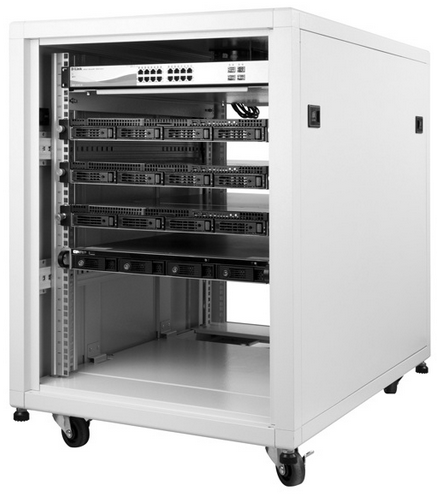

# 主機防禦基礎

這裡是資安防禦系列課程的基礎篇，介紹資訊安全的基礎知識

在這裡你會瞭解到：

*   常見主機介紹
*   作業系統的特性
*   主機安全的重點概要

推薦先修：計算機概論、作業系統、計算機結構

_這不是傳統的課程，請不要來“聽課”，腦袋硬梆梆的是做不好資安的，請不吝跟大家分享想法_

另外如果你已經有相當經驗，可以跳過這堂課，但也歡迎來聊天

授權方式 [CC: BY-SA](https://creativecommons.org/licenses/by-sa/3.0/tw/legalcode) 

#### 總結

本篇介紹了**主機的類型、特性、組成、防禦重點**

至於實務的部分，預定將在第四場為大家實際展示如何針對一台Linux主機進行強化

整篇的主題，是想傳達一個概念：**主機是攻防的最小單位，守好一台主機不但是有跡可循的，也是實現安全的關鍵核心**

## 關鍵的那個人

提問：有哪些人是網管，或維護過自己的主機的？或是是開發者，有跟網管交手過的？

提問：你們會怎麼形容一個網管？

先來一遍Overview

## 功能類別

*   PC(pos機也是)
*   Server
*   Embedded system
*   Mobile Device

    *   當然，ATM也是
    *   https://www.youtube.com/watch?v=HmS5Bp3OrRg

## 主要分層

*   硬體
*   作業系統
*   平台（Runtime, Server）
*   應用程序

## 硬體特性

提問：有沒有人玩過伺服器的？嵌入式系統？

提一下以前被老爸玩的趣事，然後鼓勵大家這樣去玩自己的小孩（喂

>   如果你對硬體不太熟悉，可以試著google一下自行組裝桌上型電腦的教學
>   https://isite.tw/2015/03/07/13023 
>   https://isite.tw/2015/03/09/13021 
>   https://isite.tw/2015/03/01/404

### 遠程控制

*   Server Remote control

*   DELL: iDRAC

*   IPKVM

### 本地安全

*   BIOS密碼
*   USB Boot
*   硬碟鎖
*   機櫃鎖
*   門禁與保全

**備份、HA(**High availability)**、磁碟陣列**

服務可用性與災難復原也是一個重點

超出課程範圍外了，自己去google

## 作業系統

提問：有沒有本科系的人？

你們怎麼形容一個作業系統？

https://zh.wikipedia.org/wiki/%E6%93%8D%E4%BD%9C%E7%B3%BB%E7%BB%9F

### 任務

*   執行程式
*   調度資源
*   提供使用者操作介面
*   權限、隔離

### 類別與特性

*   Windows
*   Unix-Like

     *   Linux
     *   BSD
     *   Solaris

*   Mobile

     *   iOS
     *   Android

*   Other

### 常見的

*   Windows 
*   Windows Server
*   Redhat RHEL
*   Centos
*   Ubuntu
*   ...

## 平台

後面會細談

### Runtime

* Strtus2 OGNL表達式搭配過濾不當導致各種各樣的遠程命令執行弱點
  > http://rickgray.me/2016/05/06/review-struts2-remote-command-execution-vulnerabilities.html
* Java7導入動態語言轉型時，安全防禦架構破損產生大量嚴重弱點
  > http://www.ithome.com.tw/node/79034
* Laravel https://www.exploit-db.com/exploits/39318/
* Rails RCE https://www.exploit-db.com/exploits/40086/
* Bash ShellShock http://devco.re/blog/2014/09/30/shellshock-CVE-2014-6271/

### Library

* OpenSSL https://www.openssl.org/news/vulnerabilities.html

### Service

* Apache2 https://www.cvedetails.com/vulnerability-list/vendor_id-45/Apache.html
* ElasticSearch https://www.elastic.co/community/security
  > CVE-2014-3120 dynamic scripting, which allows remote attackers to execute arbitrary MVEL expressions and Java code

## 安全

### 可能的損失

*   名譽損失
*   服務停止
*   錯誤判斷
*   數據損失
*   金錢詐騙
*   吃上官司（被作為攻擊跳板）
*   資源耗用（磁碟、網路、CPU、人力等等）

### 攻擊方式

*    病毒

        *   老方法與社交工程

*    蠕蟲

        *   紅色警戒

*    駭客手打

### 駭客的階段目標

*   進入系統
*   取得權限
*   留下後門
*   尋找有價值的資訊
*   跳板攻擊下一個據點
*   干擾、欺騙、破壞、盜取

### 弱點在哪邊？

*   硬體層
*   服務與平台
*   應用層
*   程式邏輯架構
*   作業系統
*   範例

### 防護重點

*   熟悉你的系統！
*   弱點更新

       *   選擇有更新維護的作業系統與平台
       *   訂閱安全性更新通知

*   主機堡壘化
    *   Simple is better
    *   最小權限原則
    *   留意所有的進入點（尤其是管理介面）
    > 防禦實務會談更多
*   正式系統應關閉所有測試與除錯資訊，移除所有不應該出現的檔案
*   Log要看