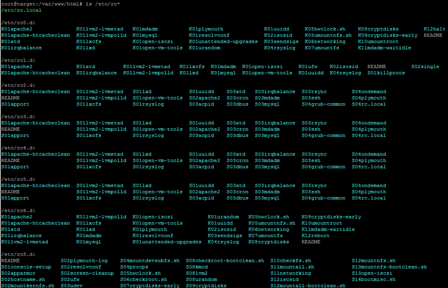
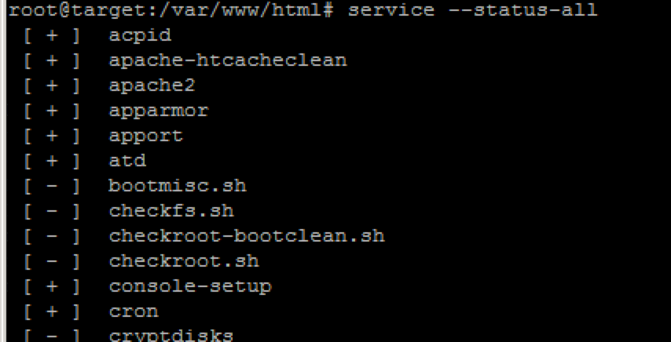
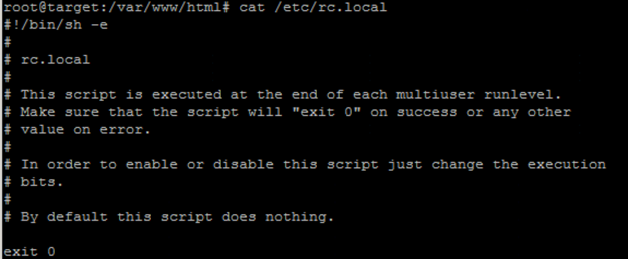
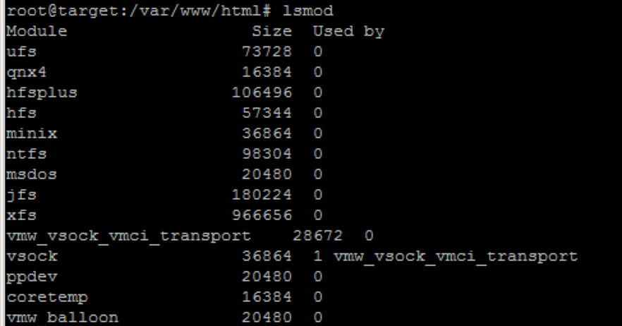
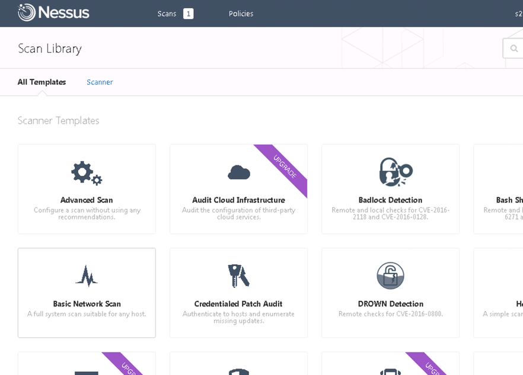
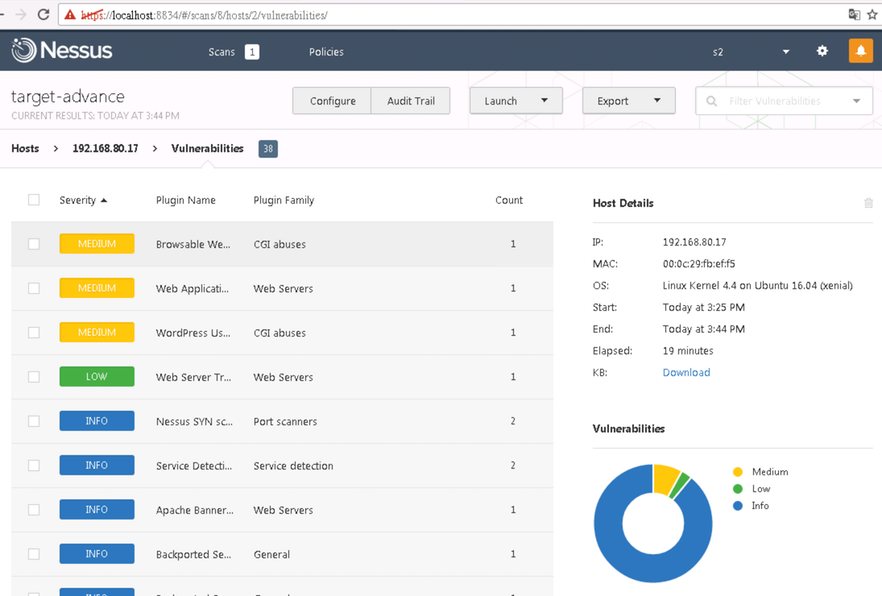
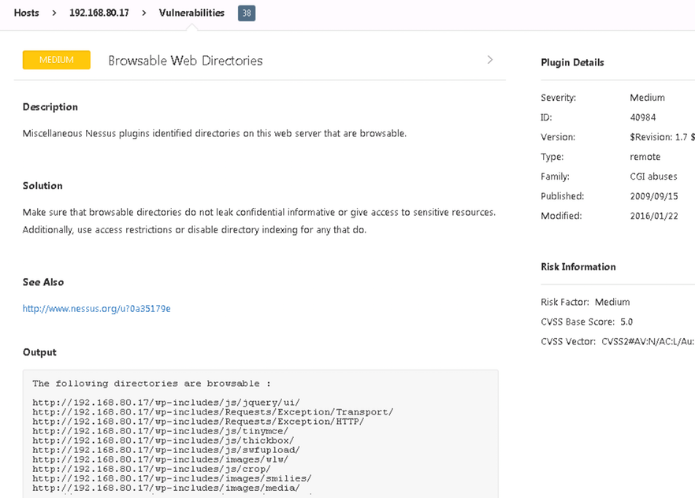
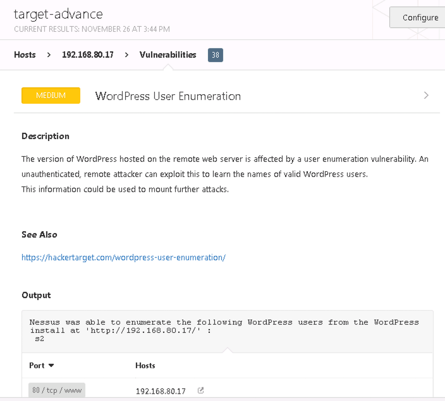

# 主機防禦實務

這裡是資安防禦系列課程的主堡防禦實務篇，告訴你**剛裝完一台主機的時候，該做哪些事情提高安全性**

我們使用Linux伺服器當範例，但也同樣適用於Unix, BSD, Solaris, MacOS, 甚至Windows

**必修**

[主機防禦基礎](/host_defense_intro.md) 

Linux基礎與伺服器管理

**參考書目**

[Linux伺服器安全防護 ](http://www.oreilly.com.tw/product_linux.php?id=a129)http://www.oreilly.com.tw/product_linux.php?id=a129

_這不是傳統的課程，請不要來“聽課”，腦袋硬梆梆的是做不好資安的，請不吝跟大家分享想法_

另外如果你已經有相當經驗，可以跳過這堂課，但也歡迎來聊天

授權方式 [CC: BY-SA](https://creativecommons.org/licenses/by-sa/3.0/tw/legalcode) 

黑魔法防禦術 FB群組 => [https://www.facebook.com/groups/308549376151517](https://www.facebook.com/groups/308549376151517)

>   乾乾乾乾講義趕不完啊

## 主軸

一台主機安裝好沒有做任何的配置就上線，就只有等著被打下來的份

主機堡壘化是每一個管理者該會且實行的基本技能

**主機建置檢查表**

    ☐ 釐清並規劃主機任務
    ☐ 規劃硬體需求
    ☐ 安排所需套件、服務
    ☐ 規劃網路配置
    ☐ 規劃使用者帳戶與權限
    ☐ 選擇適合的作業系統與安裝模式
    ☐ 於安全的環境下安裝系統與服務
    ☐ 上最新的Patch
    ☐ 移除不必要的帳號、服務、套件、權限
    ☐ 配置本機防火牆
    ☐ 訂閱安全更新通報
    ☐ 配置主機與服務監控
    ☐ 配置備份與還原機制
    ☐ 配置Log管理/紀錄機制
    ☐ 額外資安防禦（Tripwire、Chroot、AV、密碼管理、定期弱點掃描...）

## 前言

回顧一下「[主機防禦基礎](/host_defense_intro.md) 」提過的..

**迷思**

*   Unix不會中毒
*   Unix比較安全
*   有防火牆擋著不用怕

**三種威脅**

*   病毒
*   蠕蟲
*   駭客

**Linux先天比較安全？**

「**OS預設安裝完畢後，不留下任何可遠程利用之弱點**」

>   但誰會用全預設值的Linux電腦？

*   更動設定會帶來安全風險
*   服務可能被發掘出新的漏洞
*   功能性重於安全性

*   OpenSource的優點與缺點
    *   優點：比較多人review, 漏洞相對抓的比較乾淨
    *   缺點：你不修大家都知道可以打（漏洞已被公開，容易被利用）
>補充一下，Zero day指的是尚未被公開，大眾所不知道的漏洞
一般來說我們會希望盡量少一點Zero days, 因為Zero days連原廠都不知道，是沒有機會補的
OpenSource公開原始碼，所以漏洞被抓到修補的速度會比較快，理論上可以減少Zero day的存在 
而一般Close source的程式因為不允許大眾Review（不提供程式碼並用法律保護），漏洞往往是被有心人士特地挖掘出來利用的，所以理論上會有比較多的Zero days

**實際案例**

2003: 入侵者接連攻破Linux核心開發小組、Debian Project、Gentoo Linux Project與GNU Project等專門放置程式與原始碼的伺服器

2006: US CERT安全報告統計2005年回報漏洞數量：UNIX 2328個、Windows 812個

2008: RedHat官方伺服器遭受入侵，RHEL與Fedora OpenSSH套件被放置後門，並且以RedHat的金鑰簽章    

**駭客的行為**

*   外部探測

    *   Google hacking
    *   Scanning or something..
    *   社交工程

*   服務弱點

    *   設定錯誤
    *   平台弱點
    *   邏輯弱點
    *   應用程式弱點

*   本地提權

    *   核心弱點

*   後門本體

    *   網馬或其他應用程式後門
    *   Rootkit
    *   Kernel rootkit
    *   Bootkit

## 主機強化三大區塊

*   **強化作業系統  **<= 這次的課程主要任務
*   [強化Service / Application](/service_defense_intro.md) 
*   [把機器放在正確的網路中](/network_defense_intro.md) 
*   [實體安全](/physical_security.md) 

## 系統強化（主機堡壘化Bastille）

又稱「主機堡壘化」，這是任何一台主機安裝完正式上線前應該要完成的程序

堡壘化針對你的這台主機進行配置，不同的服務，不同的機構，不同的使用者都可能需要不同的設置

>   注意有一些廠商在銷售“堡壘主機”只是一個有紀錄登入資訊與帳號密碼的主機（有監控的跳板機），跟這邊的堡壘化是完全不一樣的東西

**強化準則**

*   Simple is better
*   最小權限原則

**選擇作業系統**

*   BSD

    *   OpenBSD - 最大化安全性
    *   FreeBSD 
    *   NetBSD

*   Linux

    *   RHEL v.s. CentOS v.s. Fedora
    *   SLES v.s. OpenSUSE
    *   Ubuntu
*   other
    *    Solaris?
    *    Mac Server?

**更新**

*   記得啟用安全性更新
    *   Ubuntu: aptitude safe-upgrade
    *   RHEL/CentOS/Fedora: yum install yum-security 
>如果是在隔離網段？
>   自建Repo Server clone http://askubuntu.com/questions/974/how-can-i-install-software-or-packages-without-internet-offline 
>   自建自己的Repo https://help.ubuntu.com/community/Repositories/Personal
  
   *    訂閱安全性通報
        *   SuSE: http://lists.opensuse.org/opensuse-security-announce 
        *    CentOS: http://lists.centos.org/mailman/listinfo/centos-announce
        *   RHEL: https://www.redhat.com/mailman/listinfo/enterprise-watch-list
        *   FEDORA: https://www.redhat.com/mailman/listinfo/fedora-security-list
        *   Ubuntu: http://lists.ubuntu.com/mailman/listinfo/ubuntu-security-announce
        *   OpenBSD: http://www.openbsd.org/mail.html
>Windows也是一樣，隨時都有駭客用蠕蟲在爬全世界的Public IP搜尋可以攻陷的主機
如果你的主機躲在內部網路，也不要認為自己安全了 - 駭客總是有機會繞的進來
另一方面，如果有自己做的套件或服務，別忘了自己搞定更新喔<3

**慎選你的安裝模式**

Xwindow真的很肥很肥很肥

當你想裝一個最精簡的Linux桌面環境（LXDE），你要裝上832個新套件....

*   apt install lxde
*     ....中略

另外，最小安裝可能會讓你覺得很幹，但我建議一個系統管理者一輩子至少要這個做過一次，他會讓你深入了解你日常所需的一切是從什麼地方來的

**移除不必要的東西（或至少關閉它）**

Xwindow、開發者工具、除錯工具、編譯器、DHCP之類

這也是一個機會，讓你了解你的系統中到底被塞了些什麼東西

你也可以反過來，從最小安裝開始把你要東西疊上去，很累但是你會對自己的系統有深入了解

*   apt list --installed

>   [http://askubuntu.com/questions/17823/how-to-list-all-installed-packages](http://askubuntu.com/questions/17823/how-to-list-all-installed-packages)
>    red hat 使用 yum list

**了解你的系統：檢視啟動程序**
**安裝了的服務**

*   /etc/init.d

你不一定需要看完裡面所有的script, 但請務必知道哪些服務會被啟動
**runlevel**

[http://linux.vbird.org/linux_basic/0510osloader.php](http://linux.vbird.org/linux_basic/0510osloader.php)

*   /etc/rc*.d

*   service --status-all

**啟動時帶起的設定稿**

*   /etc/rcS.d
*   /etc/rc.local

**登入時帶起的設定稿**

*   /etc/profile.d
*   /etc/profile
*   /etc/bash.bashrc
*   ~/.bashrc
*   ~/.profile

**定時執行的腳本**

*   /etc/cron.*
*   /etc/crontab
*   /var/spool/cron/*

**進階：看一下核心模組掛了啥東西**

*   lsmod

代表什麼意思？ Google "[kernel module 8250_fintek](https://www.google.com.tw/webhp?sourceid=chrome-instant&ion=1&espv=2&ie=UTF-8#q=kernel%20module%208250_fintek) "

**每個主機的任務單純化**

*   Simple is better
*   減少駭客發動組合技的機會
*   效能與除錯

**權限檢查**

*   檔案系統

       以下剛裝好的系統應該已經配置好了

    *   /etc/shadow應該只有root可以存取
    *   /etc & /usr & /lib & /boot及以下目錄應該只有root可以寫入
    *   /var/log & /var/adm 應該限制只有必要的人才可讀取
    *   適當調整 /tmp & /usr/tmp & /var/tmp 權限配置

    以下建議掃描一下，確認你知道他們的存在

    *   find / -perm +4000 -user root -type f –print
    *   find / -perm +6000 -group root -type f –print
    *   chmod u-s <filename> / chmod g-s <filename>

*   用戶權限

    理解  /etc/passwd

           _gamecontrollerd:!:247:247:Game Controller Daemon:/var/empty:/usr/bin/false

    *   應該存在哪些帳戶？

        *   在啟用任何用戶帳號前，仔細考量
        *   關閉/刪除不必要的帳戶
        *   離職者務必關閉權限或帳戶

    帳戶該有的限制

       *   最小特權原則（帳號、Chroot）
       *   留意shell與登入權限
            *   /bin/false
            *   /sbin/nologin

    *   限制使用者資源（ulimit / quota）

*   特權帳戶？

    *   使用sudo取代su
    *   沒有必要不要動用root（系統服務、Crontab、日常操作）

>   ubuntu的root預設是無法使用的，這是好事

*   確保帳戶不會被濫用

       *    密碼原則
       *    密碼強度
       *    定期更換密碼
       *    登入失敗凍結帳號
       *    超時登出
       *    非密碼的驗證方式
            *    金鑰
                    *   要留意他不受密碼限制！
            *   兩階段驗證

>   [https://blog.gslin.org/archives/2016/08/23/6769/nist-%E6%96%B0%E7%9A%84%E5%AF%86%E7%A2%BC%E8%A6%8F%E7%AF%84/](https://blog.gslin.org/archives/2016/08/23/6769/nist-%E6%96%B0%E7%9A%84%E5%AF%86%E7%A2%BC%E8%A6%8F%E7%AF%84/)
    NIST的新密碼原則建議：
    ＊有「安全問題」反而會讓系統安全變弱。
    ＊要求使用者有大小寫、特殊符號這種讓使用者更難記密碼的限制，反而會讓使用者選出更差的密碼。讓使用者自由選擇密碼，同時用黑名單機制把常見的密碼擋下來會是比較好的選擇。
    ＊定期換密碼反而會讓使用者選擇更差的密碼 (因為要花力氣記，所以會選擇簡單的密碼)，不如讓使用者選一個強一點的密碼一直用。同時要合理設計限制登入錯誤的機制。
    ＊絕對不可以存明碼。

**檢視有開的網路服務**

有些服務你根本不會想到為什麼他會開在那邊..

*   netstat -anp | grep ":\*"

## 本機防火牆

*   防火牆原則：預設拒絕
*   Accept any from inner user?
*   阻擋來源IP詐騙封包（RFC1918）

        *   255.0.0.0/8、0.0.0.0/8、127.0.0.0/8、192.168.0.0/16、172.16.0.0/12、10.0.0.0/8、me
    *   Why?

*   外對內只允許你打算公開的特定服務

        *   慎選你的對外服務
        
*   如果是Server：內對外嚴格過濾與紀錄Log
    *    關於後門與駭客攻擊

>   ssh breaks everything!
   如果不需要對外部服務，則直接禁止該主機外連是個好主意
    ubuntu對自己的預設安全性很有自信...

*   視情況使用更高階的應用層防火牆對內容進行過濾或轉譯
>你永遠不會知道協議實作中有沒有什麼漏洞存在...

**Iptable Sample**

       modprobe ip_tables
       # modprobe ip_conntrack_ftp
       iptables --flush
       iptables --delete-chain
       iptables -P INPUT DROP
       iptables -P FORWARD DROP
       iptables -P OUTPUT DROP
       iptables -A INPUT -i lo -j ACCEPT
       iptables -A OUTPUT -o lo -j ACCEPT
       iptables -A INPUT -s 255.0.0.0/8 -j DROP
       iptables -A INPUT -s 0.0.0.0/8 -j DROP
       iptables -A INPUT -s 127.0.0.0/8 -j DROP
       iptables -A INPUT -s 192.168.0.0/16 -j DROP
       iptables -A INPUT -s 172.16.0.0/12 -j DROP
       iptables -A INPUT -s 10.0.0.0/8 -j DROP
       iptables -A INPUT -s <my_interface_ip> -j DROP
       iptables -A INPUT -p tcp ! --syn -m state --state NEW -j DROP
       iptables -A INPUT -j ACCEPT -m state --state ESTABLISHED,RELATED
       iptables -A INPUT <your_service_here> -j ACCEPT -m state --state NEW
       iptables -A INPUT -j DROP
       iptables -I OUTPUT 1 -m state --state RELATED,ESTABLISHED -j ACCEPT
       # iptables -A OUTPUT -p icmp -j ACCEPT --icmp-type echo-request
       iptables -A OUTPUT -p udp --dport 53 -m state --state NEW -j ACCEPT
       iptables -A OUTPUT -j DROP
       iptables -A FORWARD -j DROP

## 其他

**加密通道**

>   加密通道會在穿牆術中獨立講
>    [諜對諜](/anti-anti-monitoring.md)：網路流量穿越、隱藏

有時你的主機的網路並不如你所信任，例如學術網路

幾種加密通道型態

最簡單的方式：ssh

**備份與還原**

>   自己找資源，我只講重要性

備份的可用性

安全的保管備份

**防毒軟體？**

嗯，有。 [ClamAV](http://www.clamav.net/) 

[http://kirby86a.pixnet.net/blog/post/94624924-%E5%AE%89%E8%A3%9Dclamav%E9%98%B2%E6%AF%92%E7%A8%8B%E5%BC%8F](http://kirby86a.pixnet.net/blog/post/94624924-%E5%AE%89%E8%A3%9Dclamav%E9%98%B2%E6%AF%92%E7%A8%8B%E5%BC%8F)

特性：大多數的病毒碼是針對Windows執行檔的！

注意：什麼時候使用？

*   NAS、FTP、Mail Gateway、Proxy....

>   小心... [https://www.rapid7.com/db/modules/exploit/unix/smtp/clamav_milter_blackhole](https://www.rapid7.com/db/modules/exploit/unix/smtp/clamav_milter_blackhole)

**完整性檢查**

*   Host IDS, Tripwire

>   [http://crypto.nknu.edu.tw/netsec/using-Tripwire.htm](http://crypto.nknu.edu.tw/netsec/using-Tripwire.htm)

*   Rootkit hunter

>   [http://linux.vbird.org/linux_security/0420rkhunter.php](http://linux.vbird.org/linux_security/0420rkhunter.php)

**Log管理**

>   另有專門的Log管理來談這件事
   [Log分析ethen](log_analysis_intro.md)- 誰黑了我的主機？！

三大重點：保存、分析、稽核

>   登入登出、特權指令、危險指令、設定變更...
    Windows有一系列的稽核選項可用

**自動化工具**

*   [Bastille Linux](http://bastille-linux.sourceforge.net)    
*   [https://github.com/CISOfy/lynis](https://github.com/CISOfy/lynis)

**定期檢查**

Rootkit Hunter

自我檢查

找出所有允許互動登入的帳戶

       cat /etc/passwd | grep -v "/bin/false" | grep -v "/sbin/nologin"

找出所有允許密碼登入的帳戶

       sudo cat /etc/shadow | awk -F: '($2!="*" && $2!="!"){print $1}'

>   請大大提供更多需要被檢查的項目

**稽核**

雙階段認證

*   Google Authenticator
*   SSH Key Pair + Server-Side Password

>   [https://sysconfig.org.uk/two-factor-authentication-with-ssh.html](https://sysconfig.org.uk/two-factor-authentication-with-ssh.html)

*   knockd [http://linux.vbird.org/linux_security/knockd.php](http://linux.vbird.org/linux_security/knockd.php)

異常通知

*   Email
*   SMS

*   [http://stackoverflow.com/questions/10797150/how-to-run-a-script-after-user-login-authentication-in-linux](http://stackoverflow.com/questions/10797150/how-to-run-a-script-after-user-login-authentication-in-linux)
*   [http://askubuntu.com/questions/179889/how-do-i-set-up-an-email-alert-when-a-ssh-login-is-successful](http://askubuntu.com/questions/179889/how-do-i-set-up-an-email-alert-when-a-ssh-login-is-successful)

**SELinux**

*   [http://linux.vbird.org/linux_basic/0440processcontrol.php#selinux](http://linux.vbird.org/linux_basic/0440processcontrol.php#selinux)

**重編Monolithic Kernel**

*   [http://linux.vbird.org/linux_basic/0540kernel.php](http://linux.vbird.org/linux_basic/0540kernel.php)

## 如何驗證

**網路掃描**

nmap [https://nmap.org/download.html](https://nmap.org/download.html)

下面是使用教學，也有Windows版

[http://www.lijyyh.com/2012/03/nmap-using-nmap-security-scanner.html](http://www.lijyyh.com/2012/03/nmap-using-nmap-security-scanner.html)

**主機弱點掃描**

Nessus [https://www.tenable.com/products/nessus-vulnerability-scanner](https://www.tenable.com/products/nessus-vulnerability-scanner)

[http://download.ithome.com.tw/article/index/id/2168](http://download.ithome.com.tw/article/index/id/2168)

相同但是OpenSource的還有

OpenVAS [http://www.openvas.org/](http://www.openvas.org/)

[http://www.myhome.net.tw/2015_01/p08.htm](http://www.myhome.net.tw/2015_01/p08.htm)

>   下載kali
   [https://www.kali.org/](https://www.kali.org/)
    用光碟開kali使用內建的OpenVAS掃瞄
    [http://sunmr.blogspot.tw/2015/02/openvas-kali-linux.html](http://sunmr.blogspot.tw/2015/02/openvas-kali-linux.html)

## 實戰練習題

架設一網站伺服器，目的是**使用套件Wordpress**架設一網站

平台使用**Linux + Apache2 + PHP + Mysql**（LAMP架構）

使用**弱點掃描軟體掃描這台主機**

>   Nessus，或用任何其他的弱掃工具皆可

看一下掃出來的報告的弱點，查一下他的意義，然後**來論壇跟大家分享一下你的報告與心得**

>   講一下虛擬機使用

**檢視弱掃報告**

)https://www.owasp.org/index.php/Testing_for_User_Enumeration_and_Guessable_User_Account_(OWASP-AT-002)

>   弱點掃描是不是要開一章來講.....

**延伸閱讀**

MacBook / MacOS強化

https://github.com/drduh/macOS-Security-and-Privacy-Guide

**主機稽核**

登入登出 /var/log/secure

auditd

https://access.redhat.com/documentation/en-US/Red_Hat_Enterprise_Linux/6/html/Security_Guide/chap-system_auditing.html

Log管理